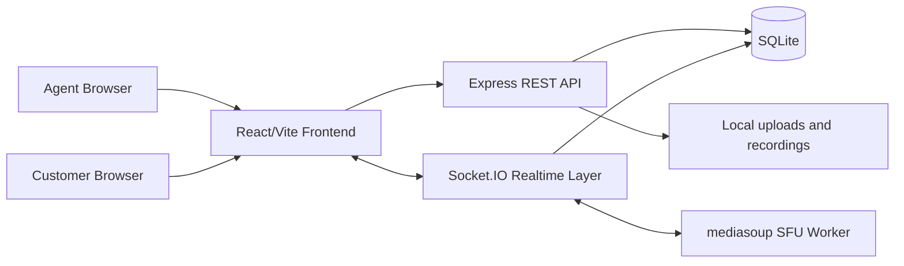

# AtomQuest Real-Time Video Support Platform

A locally runnable support video platform for the AtomQuest finale problem statement. It lets a support agent create a private call, invite a customer, run routed video/audio through a self-hosted mediasoup SFU, chat, share files, record a demo clip, and review session history.

## Quick Start

0. Enable pnpm through Corepack if needed:
   ```bash
   corepack prepare pnpm@9.15.4 --activate
   ```

1. Install backend dependencies:
   ```bash
   cd backend
   pnpm install
   copy .env.example .env
   pnpm run dev
   ```

2. Install frontend dependencies in a second terminal:
   ```bash
   cd frontend
   pnpm install
   pnpm run dev
   ```

3. Open `http://localhost:5173`.

Default agent passcode:

```text
atomberg-agent
```

## Demo Flow

1. Login as agent.
2. Create a support session.
3. Copy the invite link.
4. Open the invite link in another browser window or incognito tab as the customer.
5. Allow camera and microphone in both windows.
6. Verify two-way routed audio/video, chat, mute/camera controls, file sharing, recording status, and session end.
7. Return to the dashboard to review history.

## Architecture



## Requirement Coverage

- Session management: agent-created sessions, invite tokens, active participant tracking, clean end flow, persisted event history.
- Audio/video calling: browser camera/mic, mediasoup SFU server-routed publishing and consuming, mute and camera toggles.
- In-call chat: real-time Socket.IO messages persisted in SQLite.
- Roles/access: passcode-protected agent actions, customer invite-token access only.
- Recording bonus: agent-controlled demo recording upload with `idle`, `in_progress`, `processing`, and `ready` states.
- File sharing bonus: chat file uploads stored in `backend/uploads`.
- Reconnect bonus: 15 second grace window before a dropped participant is marked as left.
- Admin dashboard bonus: agent dashboard lists sessions and can reopen/end active sessions.
- Observability bonus: Prometheus-style metrics at `http://localhost:4000/metrics`.

## API Notes

- Backend: `http://localhost:4000`
- Frontend: `http://localhost:5173`
- Health check: `GET /health`
- Metrics: `GET /metrics`
- Agent login: `POST /api/agent/login`
- Create session: `POST /api/sessions` with `Authorization: Bearer <agentToken>`

## Known Local Demo Notes

- mediasoup uses UDP/TCP ports `40000-40100` for WebRTC media.
- On another machine or cloud host, set `ANNOUNCED_IP` in `backend/.env` to the public or LAN IP.
- Browsers require HTTPS for camera/microphone on non-localhost origins.
- The recording feature is intentionally demo-pragmatic: the live call media is routed through the SFU, while the saved recording is captured in the agent browser and uploaded to the backend.
